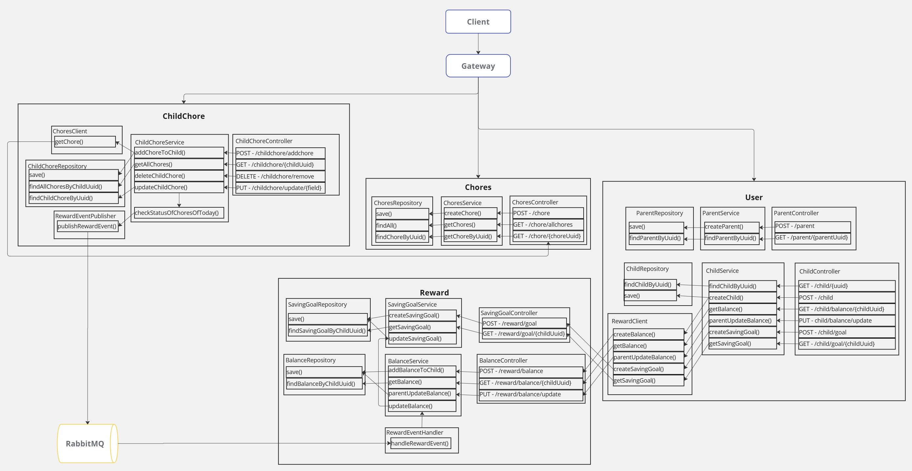

## Description of the app
This app is designed to motivate children to complete their household chores while gaining experience with basic
economics and earning their own money. Examples of chores include vacuuming, cleaning their room, taking out the
trash, and walking the dog.  
Parents can create an account and multiple child profiles. From a predefined list, parents can assign chores to
their children. If a specific chore isn't listed, parents can add new chores to the list. Before adding the chore to a child, 
the parent adds the value of completing the chore and what day the
chore is to be completed. The parent can remove a chore or edit the date and value after the chore is assigned to a child. 
Additionally, parents can set saving goals for their children, helping them see how much more they need to earn to reach 
their goals.   
Each child has their own profile displaying their current chores, balance and savings goals. Children can mark chores
as completed once they are done. Upon marking all chores for the day as completed, an allocated amount of virtual
money is added to their balance and deducted from their savings goal. While the app manages virtual money, if a child
spends real money, parents can manually adjust the child's balance to reflect the expenditure.

## Instructions on how to build, start and run the application
### Build
First, package the services using Maven  
Run `mvn clean package -DskipTests` in the root folder of the project  
This app uses Java version 20.  
I have used 'docker build' to build the images for every service   
To build all the images run `./build_docker.sh` in the root folder of the project   
**A table with tags for the different services**  

| Service         | Tag                                              |
|-----------------|--------------------------------------------------|
| gateway         | gateway:0.0.1                                    |
| consul-importer | consul-importer:1.15.0 (folder: ./docker/consul) |
| user            | user:0.0.1                                       |
| reward          | reward:0.0.1                                     |
| childChore      | childchore:0.0.1                                 |
| chores          | chores:0.0.1                                     |

### Start
To run this app, you need to have Docker Compose installed  
Navigate to `./docker` and run the command `docker-compose up` 
To check the status of the services, go to Consul in your browser: http://localhost:8500/

### Run
This project includes only a backend. To test it, please use Postman.

## Postman
#### Import Collection
1. Open Postman and go to the Collections tab
2. Click on the Import button
3. - Add this [collection](./chores.postman_collection.json)-file and click Import  
OR 
   - copy the content in the file, paste it and click Import

#### Import Environment
1. Click on the Environment tab
2. Click on the Import button
3. - Add this [environment](./environment.postman_environment.json)-file and click import  
OR 
   - copy the content in the file, paste it and click 
4. Set "Current value" to today's date (replace {dd} with today's date) "2024-12-{dd}T19:26:38.518+01:00" 
save and overwrite
5. Select this environment to run the collection in

#### Run the collection in Postman
1. 

**The steps in the collection** 
1. POST /parent: A parent is created 
2. GET /parent/{parentUuid}: Get the parent. Can see a list of the parents children. When the parent is creates, the list is empty 
3. POST /child: Add a child to the parent 
4. GET /child/balance/{childUuid}: Get a child's balance 
5. POST /child: Add a second child to the parent 
6. (3x) POST /chore: Add three different chores to the database 
9. GET /chore/allchores: Retrieve all chores from the Chores database 
10. POST /childchore/addchore: Assign the first chore to the first child 
11. POST /childchore/addchore: Assign the second chore to the first child 
12. POST /childchore/addchore: Assign the third chore to the first child 
13. POST /child/goal: Create a saving goal for the first child 
14. GET /child/goal/{childUuid}: Get the saving goal for the first child 
15. PUT /childchore/update/date: Update the date of the first chore for the first child 
16. PUT /childchore/update/value: Update the value of the first chore for the first child 
17. PUT /childchore/update/status: Update the status of the first chore for the first child 
18. DEL /childchore/remove: Remove the second chore for the first child 
19. GET /childchore/{childUuid}: Retrieve a list of today's chores for the first child 
20. PUT /child/balance/update: A user adjusts the balance for the first child

### The services
- ### gateway
The gateway serves as an important intermediary, efficiently routing requests between clients and backend services
(User, ChildChore and Chores). Its primary function is to direct incoming requests to the appropriate backend service, ensuring 
that each request reaches its intended destination. Additionally, the gateway manages traffic distribution across multiple 
service instances, balancing the load to improve performance and reliability, while preventing any single instance from 
becoming overwhelmed.  
By integrating with Consul, a service registry, the gateway dynamically discovers available service instances, allowing 
it to adapt to changes in real time and maintain seamless communication between clients and services.

- ### consul-importer
This service exports configurations to Consul, then terminates. It now configures the name of the service instances for each service.

- ### user
The service is responsible for managing the user profiles. This service calls 
Reward service when a child's balance and saving goal are created, when a child's balance is updated by its parent 
and when the child want to get its current balance and saving goal. The service has its own database with the tables parent and child.

- ### reward
This service is responsible for creating, storing, and updating a child's balance and saving goal. The Rewards 
component listens to RabbitMQ for messages containing a child's list of completed chores for the day and subsequently 
updates the balance and saving goal. The service has its own database with the tables balance and saving_goal.

- ### chores
The service is responsible for creating, storing, and retrieving chores from the database. The service has its own database with the table chore.

- ### childChore
The service is responsible for managing the child’s chores and to check the 
status of the child’s chores of the day. If all the chores of the day are completed, the 
ChildChore service sends a message to RabbitMQ containing the child’s chores of the 
day. When a chore is added to a child, a call is made to the Chores service to validate whether the chore 
exists in the database. The service has its own database with the table child_chore.

## User stories
### MVP
- As a parent user, I can create a child profile and add chores to it, so that I can manage the 
child’s chores
- As a parent user, I can create a saving goal on a child profile, so that the child can gain 
experience with economics
- As a child user, I can access my profile, so that I complete the chores of the day, see my 
balance and the progress towards my saving goal

### Prototype
- As a parent user, I want to select a chore from a predefined list and customize it with a 
specific date and value, so that I can add it to my child's list of chores.
- As a parent user, I want to create a new chore, so that I can add it to my child later
- As a parent user, I can create several child profiles, so that I can manage several children
- As a parent user, I can remove chores from my child profiles, so that I can adjust the list 
to changes happening that day
- As a parent user, I can move the completion date of a chore, so that I can postpone a task 
that cannot be completed that day
- As a parent user, I can change the value of the completion of a child's chore, so that I can motivate the child
to complete the chore
- As a parent user, I can update my child’s balance when they are using their earnings, 
so that the balance is correct

## Architecture diagram

